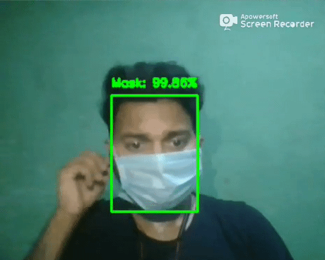
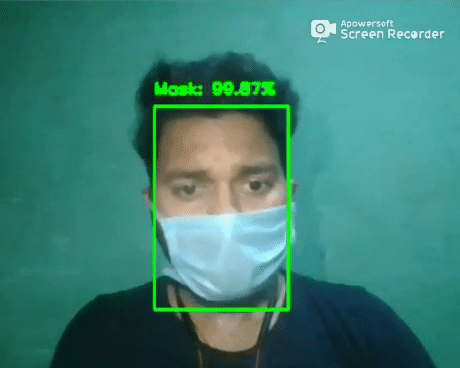
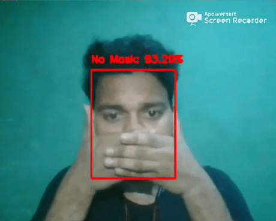
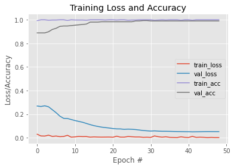

# Face-Mask-Detection
## ⌛**Project Demo**
<table> 
  <tr>
    <td></td>
    <td></td>    
  </tr>
  <tr>
    <td><b>Mask or No Mask</b></td>
    <td><b>Mask Under the Nose</b></td>
  </tr>
  <tr>
    <td></td>
     <td></td>
  </tr>
   <tr>
    <td><b>Showing Hand Infront of Mouth</b></td>
    <td><b>Ringing Alarm</b></td>
  </tr>
 </table>
 
 ## 📌**Objective**
The objective of this project is to detect the presence of a face mask on human faces on live streaming video as well as on images and alert the authority to take action on those who'r not wearing mask.

## 📁**Dataset**
Click [here](https://www.kaggle.com/prithwirajmitra/covid-face-mask-detection-dataset) to download the dataset.

The use of several datasets was necessary to collect different scenarios:
- People of different racial and ethnicities
- Masks of different types
- Masks in different positions
- Different Angles

## 🔑**Prerequisites**
All the required libraries are included in the file <code>requirements.txt</code>

## ⚠️**TechStack/framework used**
- Tensorflow
- Keras
- OpenCV
- Caffe Model
- MobileNetV2

## 🚀**Installation**
Step-1: Clone this repository
```
$ git clone https://github.com/sidharth178/Face-Mask-Detection-and-Alert-System.git
```
Step-2: Change your directory to the cloned repository
```
$ cd Face-Mask-Detection-and-Alert-System
```
Step-3: Install required libraries
```
$ pip install -r requirements.txt
```
Step-4: Do Mask detection on webcam & alert them
```
$ python detect_mask_live.py
```

## 🅰️**Accuracy & Loss**


## ❤️**Owner**
Made With ❤️ by [Sidharth kumar mohanty](www.linkedin.com/in/sidharth178)

## 😖Troubleshoot
Any issues??? Feel free to ask.[Linkedin](www.linkedin.com/in/sidharth178)

If you find this repo useful,don't forget to give a ⭐

Thanks! ❤️
